# Workstation architecture views

These views help the owner locate management authority, K3s components and
workload data. They describe source configuration, not discovered services or a
successful workstation installation. The installer checkout is named
`ArchLinuxThreadripperAI`; its Git repository is named `ArchLinuxThreadripper`.

Boxes identify components or stores; enclosing boxes identify placement,
authority or an explicitly labelled logical group. Solid arrows describe
supported configured relationships, not live traffic. Dashed arrows identify
optional or incomplete access paths. Dashed
amber boxes also state their qualification or configuration gate in text.
These are C4-informed deployment and component views using Mermaid flowchart
notation, not formal C4/UML conformance claims.

## 1. Private management plane

[Open the full-size view](diagrams/bridge-deployment.svg) ·
[Edit the Mermaid source](diagrams/bridge-deployment.mmd)

Bridge runs on the Arch host, outside K3s. It can report an unavailable cluster
without losing its own API. The API service and build worker are unprivileged;
only the allowlisted host helper runs as root. The helper and installed session
runtime share recovery and locking rules. Their journals are separate from the
controller's bounded JSON store. See [ownership and recovery](ARCHITECTURE.md)
and the [host executor](HOST-EXECUTOR.md).

Owner browser access needs a dedicated trusted HTTPS hostname and explicit
browser-session policy. A VPN is owner-managed infrastructure, not a service
installed by Bridge. Live loopback HTTP is CLI-only. Bridge does not proxy model
inference, RAG, game streams or public compute traffic. Public-domain compute
access still needs a separate reviewed authentication and exposure design.

The worker produces bounded offline build artifacts. A successful build does
not qualify a GPU, install an image, or promote a kernel. Native llama.cpp HIP
and Vulkan builds are not additional Kubernetes serving deployments.

## 2. Bare-metal K3s components

[Open the full-size view](diagrams/k3s-components.svg) ·
[Edit the Mermaid source](diagrams/k3s-components.mmd)

The main path is one `k3s server` on Arch, with SQLite and embedded containerd.
The API server, scheduler, controller manager and node services are host
processes, not application pods in `ai-home-lab`. The separately retained
AlmaLinux VM lab has its own guest kernel, embedded etcd and different add-on
configuration. It is not an HA member of this bare-metal cluster and has no
default GPU passthrough. Do not copy its cert-manager or Retain storage settings
into the bare-metal diagram.

CoreDNS, Traefik, metrics-server and local-path are bundled K3s add-ons retained
by this configuration. ServiceLB is disabled; no external address allocator is
supplied for Traefik. An Ingress object alone therefore does not establish a
reachable LAN or public endpoint. metrics-server supplies resource metrics; it
does not mean OpenTelemetry, Elastic or Prometheus has been deployed.

The GPU Operator path requires explicit deployment. Arch owns `amdgpu` and
firmware. The operator reconciles the traditional device plugin and node labels;
driver management, KMM and the AMD DRA driver are disabled. NFD labels do not
prove peer transfers. `amd.com/gpu: 1` requests an exclusive device count, not a
particular PCI address. The two expected R9700s have separate 32 GiB VRAM pools.
CPU Manager static policy is optional; it is not host-process or IRQ isolation.

PVCs use the bundled node-local provisioner on the encrypted NVMe-backed root.
The default StorageClass has `WaitForFirstConsumer` binding and **Delete** reclaim
policy. Claim sizes are requests, not enforced filesystem quotas. There is no
replication. Keep the existing md RAID0 → LUKS2 → XFS layout and its data-loss
risk distinct from storage provisioning. The host backup procedure still needs
an owner-reviewed bare-metal K3s state and PVC backup scope.

## 3. Workloads, retrieval and streaming

[Open the full-size view](diagrams/workload-data-paths.svg) ·
[Edit the Mermaid source](diagrams/workload-data-paths.mmd)

All application deployments shown start with **zero replicas**. Image, hardware
and access qualification remain prerequisites. The default overlay selects the
two-GPU SGLang resource configuration; the one-GPU SwarmUI workload is also
defined, but that does not mean both can run concurrently on two cards.

Open WebUI calls SGLang's internal OpenAI-compatible API. Default-deny
NetworkPolicy permits the shown Traefik-to-WebUI and WebUI-to-SGLang paths.
SwarmUI includes its ComfyUI backend in the same pod but has no permitted
application ingress yet.

The optional RAG overlay adds CPU embedding inference and embedded Chroma to
Open WebUI. It uses isolated pilot data and embedding-model claims instead of
the base WebUI data mount. It does not deploy Qdrant, PostgreSQL/pgvector or a
separate retrieval API. Qwen Code, DSH and Hermes run on the developer's client.
Their owner-authorized loopback port-forward uses Kubernetes API authorization;
it is not ordinary pod ingress and does not grant access to WebUI RAG collections.

Gaming overlays are optional. Their rootful entrypoint, input/display access,
`SYS_ADMIN` versus baseline Pod Security, and separate L4 exposure remain gates.
Moonlight connects to Sunshine; Steam Remote Play is an alternative that needs
a reviewed manifest with Sunshine disabled. Traefik is not the game-streaming
transport. Parent/kids overlays use separate persistent homes. The diagram shows
one selected session, not two simultaneous gaming allocations.

Session handover stops managed GPU workloads and checks release before starting
the selected workload. It does not promise one-GPU AI plus one-GPU gaming at the
same time. Pausing requests is not proof of released model memory. Build outputs
and model publication also remain separate from workload activation.

The diagram's model claim must map to the actual persistent model root used by
Bridge. Do not assume `/srv/ai/bridge-models` automatically maps to a provisioned
`llm-models` claim. Follow the [installation mapping](OPERATIONS.md) and
[qualification checklist](QUALIFICATION.md) before enabling model consumption.

## Source map

Installer paths below are relative to the installer checkout at the revision
listed above. Bridge links are relative to this repository.

| Area | Authoritative source |
| --- | --- |
| API, helper and worker placement | [Systemd units](../deployment/systemd), [architecture](ARCHITECTURE.md), [host protocol](../internal/hostexec), [worker](../internal/worker) |
| Installed commands and state | [Operations](OPERATIONS.md), [Arch package recipe](../packaging/arch/PKGBUILD.in), [state retention](../internal/store/store.go), [initial source import](../internal/source/source.go) |
| Bare-metal K3s and CPU policy | Installer `infrastructure/ansible/roles/k3s_baremetal/`, `infrastructure/ansible/group_vars/ai_lab_baremetal.yml`, `versions.lock` |
| GPU ownership and allocation | Installer `infrastructure/gpu-operator/values.yaml`, `deviceconfig.yaml`, `chart.lock` in the same directory |
| Default app composition and networking | Installer `apps/overlays/default/`, `apps/overlays/dual-gpu/`, `apps/base/network-policy.yaml`, `apps/overlays/single-gpu/ingress.yaml` |
| App containers and persistent claims | Installer `apps/base/{sglang,open-webui,swarmui,steam-headless}/`, `apps/overlays/{parent,kids,family}/` |
| RAG and client harnesses | Installer `apps/overlays/{rag,rag-dense}/`, `docs/RAG.md`, `docs/AGENT-HARNESSES.md`; Bridge [client integration](CLI-AND-UI.md) |
| Session fencing and native builds | Installer `lib/workstation/session.sh`, `config/workstation.conf.example`; Bridge [reference contracts](REFERENCE-CONTRACTS.md) |
| Storage, backup and separate VM lab | Installer `docs/ARCHITECTURE.md`, `docs/OPERATIONS.md`, `docs/HOME-LAB.md`, `ansible/`, `kubernetes/README.md` |

Bundled K3s semantics were checked against the
[architecture documentation](https://docs.k3s.io/architecture),
[networking services documentation](https://docs.k3s.io/networking/networking-services)
and pinned `v1.35.7+k3s1` manifests for
[CoreDNS](https://github.com/k3s-io/k3s/blob/v1.35.7%2Bk3s1/manifests/coredns.yaml),
[metrics-server](https://github.com/k3s-io/k3s/blob/v1.35.7%2Bk3s1/manifests/metrics-server/metrics-server-deployment.yaml)
and [local storage](https://github.com/k3s-io/k3s/blob/v1.35.7%2Bk3s1/manifests/local-storage.yaml).
The local-storage defaults refer to that K3s bundle, not the VM lab's separate
local-path pin.

## Diagram maintenance

See [diagram maintenance](diagrams/README.md) for editable sources and rendering.
The diagrams contain no scripts or remote assets. They do not qualify ROCm,
game capture, installed services or target hardware.
